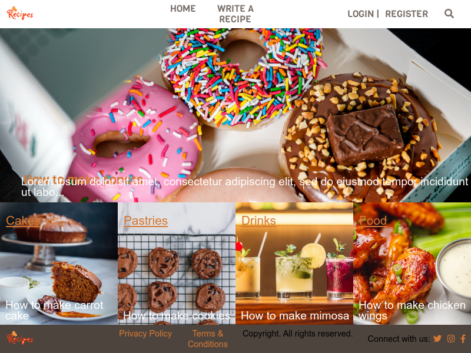
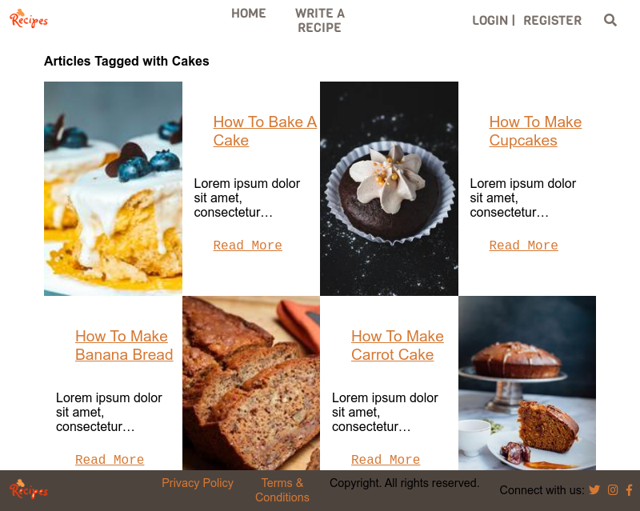

# Rails Recipe blog

> This is a Ruby on Rails Capstone project in Microverse's rails curriculum, to build a Ruby on Rails application where people can write articles. Find it the project description [here](https://www.notion.so/Lifestyle-articles-b82a5f10122b4cec924cd5d4a6cf7561#55d51338627b42bd95d86e2d1e58f105).

> This website is created to allow users to view, create, update, and store articles and images of their favorite meals. 

# See the Live version here - > [Live Link](https://rails-recipe-blog.herokuapp.com/)

### Index Page


### Categories Page


# Built With

- Ruby v2.7.0
- Ruby on Rails v6.0.3
- HTML
- CSS
- Bootstrap
- Cloudinary
- Rspec
- Capybara
- Rubocop

# Features
- Login or sign up using your name and email
- Search for articles
- Access articles created by the logged in user
- Access individual article to read more
- See who wrote the article
- Vote for Articles
- Edit articles
- See the highest voted article in the index page
- Add comments on the articles

# Prerequisites

- Ruby: 2.7.1
- Rails: 6.0.3.4
- Postgres: >=10

# Getting Started

### Get a local copy

`$ https://github.com/mimipeshy/rails_recipe_blog.git`

### Initial Setup

- Go to the local repo and run `bundle install`
- Update your yarn if its out of date with `yarn install --check-files`
- Install bootstrap with ```yarn add bootstrap jquery popper.js```

### Database Setup:
- First run `rails db:create`
- Then run `rails db:migrate`
- Lasty run `rails db:seed`

### Start server:
- Run `rails server`

- Go to `http://localhost:3000/`

- Create an account using your name and email.

- Login with your email


# Run tests

- Run  ```bundle exec rspec ``` to run the tests.


# Author

👤 **Peris Ndanu**

- Github: [@mimipeshy](https://github.com/mimipeshy)
- Twitter: [@perisndanu](https://twitter.com/pygirl254)
- Linkedin: [@perisndanu](https://www.linkedin.com/in/peris-ndanu-405083193/)


## 🤝 Contributing

Contributions, issues and feature requests are welcome!

## Show your support

Give a ⭐️ if you like this project!

## Acknowledgments

- Microverse
- Unsplash for the images used
- Heroku
- Nelson Sakwa, The designer of the [Lifestyle Articles](https://www.behance.net/gallery/14554909/liFEsTlye-Mobile-version)

## 📝 License

None


